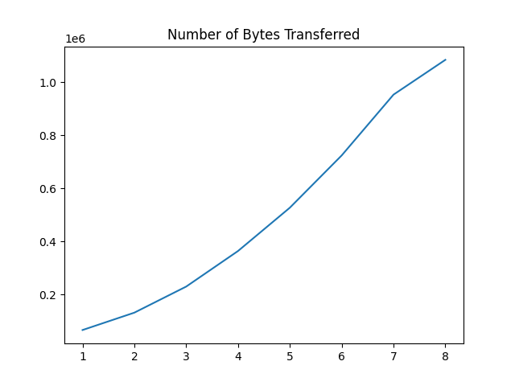

# Client server application

## Image compression and transmission
In terminal window 1, start the server:

```
python server.py
```

In terminal window 2, establish TCP/IP connection, compress and transmit image:

```
python client.py
```

<div align="center">
    
</div>

<div align="center">
    
    
</div>

## Send email

To send a custom email:

```
python send_email.py
```